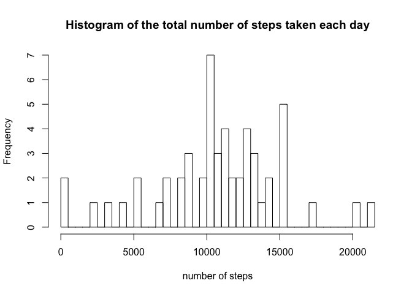
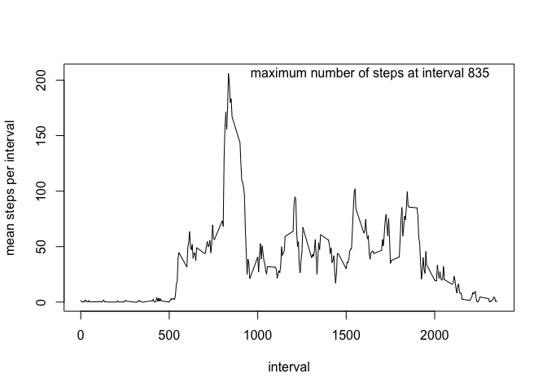
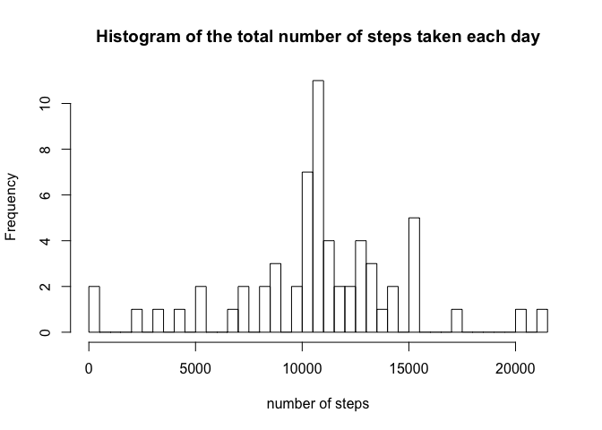
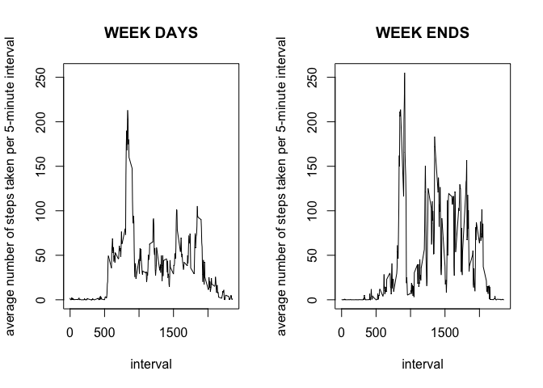

# Project W2 Reproducible research
julianehf  
29/06/2017  


## clear environment and set working directory


```r
rm(list=ls())
setwd('/Users/julianefarthouat/Documents/ETUDES/data science specialization/reproducible research/W2')
```

## Loading and preprocessing the data

Here we load and look at the data. 


```r
actdata = read.csv('activity.csv',header=T)
head(actdata)
```

```
##   steps       date interval
## 1    NA 2012-10-01        0
## 2    NA 2012-10-01        5
## 3    NA 2012-10-01       10
## 4    NA 2012-10-01       15
## 5    NA 2012-10-01       20
## 6    NA 2012-10-01       25
```

```r
str(actdata)
```

```
## 'data.frame':	17568 obs. of  3 variables:
##  $ steps   : int  NA NA NA NA NA NA NA NA NA NA ...
##  $ date    : Factor w/ 61 levels "2012-10-01","2012-10-02",..: 1 1 1 1 1 1 1 1 1 1 ...
##  $ interval: int  0 5 10 15 20 25 30 35 40 45 ...
```

```r
summary(actdata)
```

```
##      steps                date          interval     
##  Min.   :  0.00   2012-10-01:  288   Min.   :   0.0  
##  1st Qu.:  0.00   2012-10-02:  288   1st Qu.: 588.8  
##  Median :  0.00   2012-10-03:  288   Median :1177.5  
##  Mean   : 37.38   2012-10-04:  288   Mean   :1177.5  
##  3rd Qu.: 12.00   2012-10-05:  288   3rd Qu.:1766.2  
##  Max.   :806.00   2012-10-06:  288   Max.   :2355.0  
##  NA's   :2304     (Other)   :15840
```


Let's transform dates into the R-date format and check if it did properly with the *str* function.


```r
actdata$date = as.Date(as.character(actdata$date),"%Y-%m-%d")
str(actdata)
```

```
## 'data.frame':	17568 obs. of  3 variables:
##  $ steps   : int  NA NA NA NA NA NA NA NA NA NA ...
##  $ date    : Date, format: "2012-10-01" "2012-10-01" ...
##  $ interval: int  0 5 10 15 20 25 30 35 40 45 ...
```

### What is mean total number of steps taken per day?

1. We calculate the total number of steps taken per day.


```r
stepsperday = aggregate(steps~date,actdata,sum)
head(stepsperday)
```

```
##         date steps
## 1 2012-10-02   126
## 2 2012-10-03 11352
## 3 2012-10-04 12116
## 4 2012-10-05 13294
## 5 2012-10-06 15420
## 6 2012-10-07 11015
```

2. We make an histogram of the total number of steps taken each day. 

```r
hist(stepsperday$steps,
     xlab='number of steps',breaks=50,main='Histogram of the total number of steps taken each day')
```

<!-- -->

3. Calculate mean and median of total number of steps taken per day.

```r
meansteps=mean(stepsperday$steps)
mediansteps=median(stepsperday$steps)
```

Taken per day, the mean number of steps is 1.0766189\times 10^{4} and the median number of steps is 10765. 


## What is the average daily activity pattern?

1. We calculate the mean steps taken per interval averaged across all days. 


```r
stepsperint = aggregate(steps~interval,actdata,mean)
head(stepsperint)
```

```
##   interval     steps
## 1        0 1.7169811
## 2        5 0.3396226
## 3       10 0.1320755
## 4       15 0.1509434
## 5       20 0.0754717
## 6       25 2.0943396
```

Then we plot the time series of the 5-minute interval (x-axis) and the average number of steps taken, averaged across all days (y-axis).


```r
maxint = stepsperint[stepsperint$steps==max(stepsperint$steps),]$interval
max_x = with(stepsperint,which(maxint==stepsperint))

with(stepsperint, {
        plot(interval, steps,
                       type='l',ylab='mean steps per interval')
        text(maxint+800,steps[max_x],paste('maximum number of steps at interval ',maxint,sep=''))                
        })
```

<!-- -->

2. The 5-minute interval, on average across all the days in the dataset, that contains the maximum number of steps is 835.

## Imputing missing values

1. Let's check how many missing values there are in the data. 

```r
sum(is.na(actdata$steps))
```

```
## [1] 2304
```

```r
sum(is.na(actdata$date))
```

```
## [1] 0
```

```r
sum(is.na(actdata$interval))
```

```
## [1] 0
```

There were 2304 missing values of the *steps* variable. 

2. To fill the missing values, we replace it by the mean value of that 5-min interval. 


```r
actdata$steps2 = actdata$steps
for(i in c(1:nrow(actdata)  ) ){
        if(is.na(actdata[i,]$steps2)){
                int = actdata[i,]$interval
                tmp = stepsperint[stepsperint$interval==int,]$steps
                actdata[i,]$steps2=tmp
        }
}
```

Check that all missing values were remplaced: 

```r
sum(is.na(actdata$steps2))
```

```
## [1] 0
```

3. Create a new dataset that is equal to the original dataset but with the missing data filled in.

```r
actdataclean = actdata
actdataclean$steps=actdataclean$steps2
actdataclean$steps2 <- NULL
head(actdataclean)
```

```
##       steps       date interval
## 1 1.7169811 2012-10-01        0
## 2 0.3396226 2012-10-01        5
## 3 0.1320755 2012-10-01       10
## 4 0.1509434 2012-10-01       15
## 5 0.0754717 2012-10-01       20
## 6 2.0943396 2012-10-01       25
```

4. Make a histogram of the total number of steps taken each day and calculate and report the mean and median total number of steps taken per day. 

```r
stepsperdayclean = aggregate(steps~date,actdataclean,sum)
hist(stepsperdayclean$steps,
     xlab='number of steps',breaks=50,main='Histogram of the total number of steps taken each day')
```

<!-- -->

```r
meansteps=mean(stepsperdayclean$steps)
meansteps=round(meansteps,0)
mediansteps=median(stepsperdayclean$steps)
```

Taken per day, the mean number of steps is 1.0766\times 10^{4} and the median number of steps is 1.0766189\times 10^{4}. These values do not differ from the estimates from the first part of the assignment. 

Let's observe the impact of imputing missing data on the estimates of the total daily number of steps.


```r
summary(stepsperday$steps)
```

```
##    Min. 1st Qu.  Median    Mean 3rd Qu.    Max. 
##      41    8841   10760   10770   13290   21190
```

```r
summary(stepsperdayclean$steps)
```

```
##    Min. 1st Qu.  Median    Mean 3rd Qu.    Max. 
##      41    9819   10770   10770   12810   21190
```

The impact of imputing missing data on the estimates of the total daily number of steps seems very limited.

## Are there differences in activity patterns between weekdays and weekends?

1. To observe differences in activity patterns between weekdays and weekends, we create a new factor variable in the dataset with 2 levels: *weekday* and *weekend*.


```r
library(lubridate)
```

```
## 
## Attaching package: 'lubridate'
```

```
## The following object is masked from 'package:base':
## 
##     date
```

```r
actdataclean$weekday = wday(actdata$date,label=T)
actdataclean$weekdayN = wday(actdata$date,label=F)
actdataclean$weekdayWE = actdataclean$weekdayN>6
actdataclean$weekdayWE[actdataclean$weekdayWE=='FALSE'] = 'weekday'
actdataclean$weekdayWE[actdataclean$weekdayWE=='TRUE'] = 'weekend'
actdataclean$weekdayWE = as.factor(actdataclean$weekdayWE)
head(actdataclean)
```

```
##       steps       date interval weekday weekdayN weekdayWE
## 1 1.7169811 2012-10-01        0     Mon        2   weekday
## 2 0.3396226 2012-10-01        5     Mon        2   weekday
## 3 0.1320755 2012-10-01       10     Mon        2   weekday
## 4 0.1509434 2012-10-01       15     Mon        2   weekday
## 5 0.0754717 2012-10-01       20     Mon        2   weekday
## 6 2.0943396 2012-10-01       25     Mon        2   weekday
```

Now we plot the time series of the 5-minute interval and the average number of steps taken, averaged across all weekdays and all weekends. 


```r
datawe = aggregate(steps~interval*weekdayWE,actdataclean,mean)

par(mfrow=c(1,2))
with(datawe[datawe$weekdayWE=='weekday',], 
     plot(interval, steps,
          type='l',ylab='average number of steps taken per 5-minute interval',ylim=range(datawe$steps),main='WEEK DAYS') 
)
with(datawe[datawe$weekdayWE=='weekend',], 
     plot(interval, steps,
          type='l',ylab='average number of steps taken per 5-minute interval',ylim=range(datawe$steps),main='WEEK ENDS') 
)
```

<!-- -->

And this is done, thank you for reading me ! :-) 
